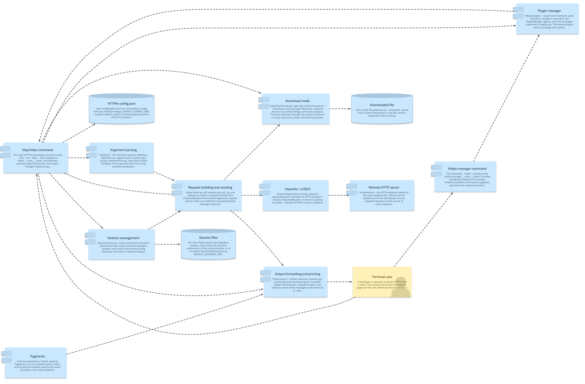
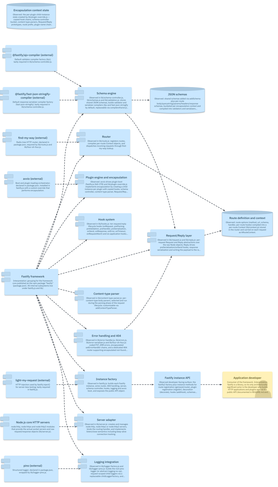
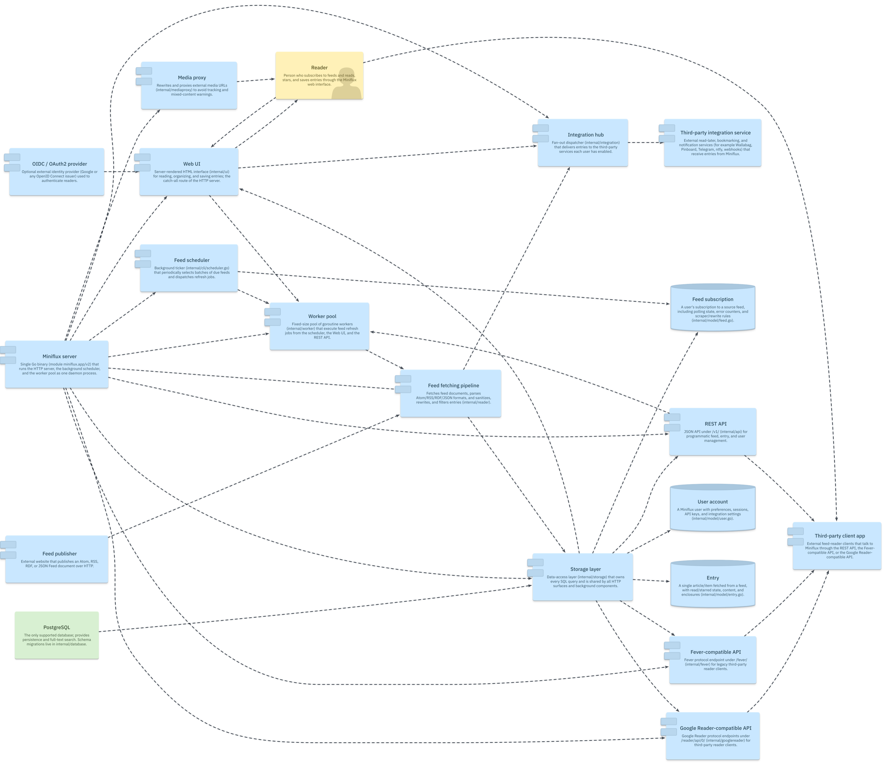
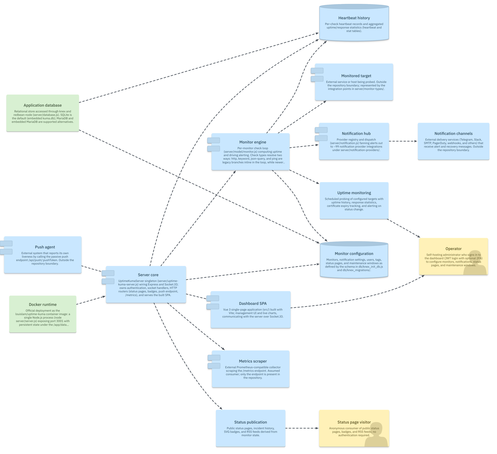
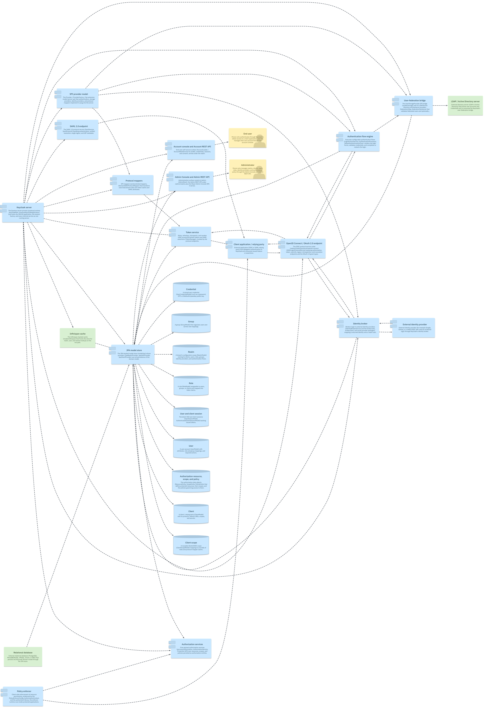
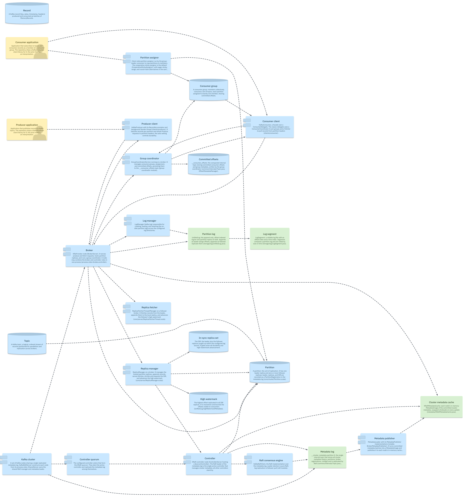

# YarraMate gallery

[YarraMate](https://github.com/yarrasys/yarramate) turns a software codebase into
a queryable, evidence-backed architecture model — the concepts, relationships,
and ordered flows of a system, read from the real source, checkable, and
projectable into focused views.

This gallery is the **reference set of those models** for six well-known
open-source projects, spanning a single-process CLI tool to enterprise
application software and distributed infrastructure. Each model was produced by
an automated discovery journey that reads the actual source, is pinned to a
specific commit, and passes YarraMate's deterministic checks.

**Browse the rendered diagrams below**, open any showcase's native model under
`.yarramate/`, or read its `JOURNEY.md` for how the model was built and what it
deliberately leaves out.

## What it looks like

Every showcase renders to a navigable architecture landscape (the whole system
on one page) plus ordered dynamic flows. The six landscapes, from a small CLI to
enterprise infrastructure:

|   |   |
|:-:|:-:|
|  |  |
| **httpie** · CLI / Python | **fastify** · framework / Node |
|  |  |
| **miniflux** · server / Go | **uptime-kuma** · app / Node+Vue |
|  |  |
| **keycloak** · IAM / Java | **kafka** · streaming / Java+Scala |

Each showcase also has ordered **dynamic flows** — e.g. Kafka's
[produce path](showcases/kafka/diagrams/produce-path.png) or Keycloak's
[brokered login](showcases/keycloak/diagrams/brokered-login-flow.png). Every
view is committed under the showcase's `diagrams/` directory.

## Showcases

Each showcase is a self-contained, validating YarraMate workspace:

```text
showcases/<repo>/
  .yarramate/       # canonical native model: documents, projections, evidence, likec4 integration
  .yarramate-out/   # derived LikeC4 export — the authoritative rendered source
  diagrams/         # rendered PNG previews of every view (regenerable; see Reproduction)
  JOURNEY.md        # discovery report: provenance, observations, evidence, coverage gaps
```

Every model passes the deterministic checks from its showcase directory:

```sh
npx -p yarramate yarramate check showcases/<repo>/.yarramate/workspace.yaml --json
```

Ordered from a single-process CLI tool to enterprise application software and
distributed infrastructure:

| Showcase | Shape / language | Model | Views | Reconciliation |
|---|---|---|---|---|
| [httpie](showcases/httpie/JOURNEY.md) | CLI tool / Python | 15 concepts, 22 relationships, 3 projections | 3 (2 dynamic) | 25/26 confirmed, 1 not-observed |
| [fastify](showcases/fastify/JOURNEY.md) | Framework library / Node | 34 concepts, 46 relationships, 3 projections | 3 (2 dynamic) | 59/60 confirmed, 1 not-observed |
| [miniflux](showcases/miniflux/JOURNEY.md) | Server daemon / Go | 20 concepts, 36 relationships, 5 projections | 5 (2 dynamic) | 36/37 confirmed, 1 unknown |
| [uptime-kuma](showcases/uptime-kuma/JOURNEY.md) | Self-hosted app / Node+Vue | 16 concepts, 20 relationships, 3 projections | 3 (2 dynamic) | 28/29 confirmed, 1 unknown |
| [keycloak](showcases/keycloak/JOURNEY.md) | Enterprise IAM server / Java (Quarkus) | 30 concepts, 53 relationships, 5 projections | 5 (2 dynamic) | 54/55 confirmed, 1 unknown |
| [kafka](showcases/kafka/JOURNEY.md) | Distributed streaming platform / Java+Scala | 26 concepts, 42 relationships, 5 projections | 5 (2 dynamic) | 68/68 confirmed, 0 findings |

The first four models were discovered on 2026-07-29 with `yarramate@0.4.0` and
re-verified against `yarramate@0.6.0` on 2026-07-30 (`check`, `reconcile`, and
`yarramate-likec4 check` all pass; every model re-exports byte-identical LikeC4
output, so no model changed on upgrade). The Keycloak and Kafka models were
discovered on 2026-08-07 with `yarramate@0.15.0`. Source commit SHAs are in each
`JOURNEY.md`.

### httpie

HTTPie is a single-process Python CLI whose `http`/`https` entrypoint
orchestrates a pipeline of internal responsibilities: an extended-argparse layer
turns argv and stdin into a resolved namespace, a client core builds and sends
the request through requests/urllib3, and an output pipeline formats and
colourises (via Pygments) the messages for the terminal — or, under
`--download`, streams the body to disk with resume support. Persistent state is
limited to a platform config directory holding `config.json` and per-host
session files, and a plugin manager loads auth/formatter/transport extensions
via package entry points.

▶ flows: [request-flow](showcases/httpie/diagrams/request-flow.png) · [download-flow](showcases/httpie/diagrams/download-flow.png) — all views in [`diagrams/`](showcases/httpie/diagrams/)

### fastify

Fastify is a single-package Node.js web framework whose factory assembles small
subsystems under `lib/`: a find-my-way-backed router, a 16-hook lifecycle
engine, schema-driven validation/serialization (Ajv + fast-json-stringify),
Request/Reply abstractions, pino logging, and node:http server creation. Its
defining mechanism is avvio-driven plugin registration with encapsulation: each
registered plugin gets a child instance with copied hooks, schemas, parsers and
decorators, isolating plugin effects to a subtree. Every request flows through a
fixed, hook-interleaved pipeline — routing → parsing → validation → handler →
serialization → response — with encapsulated error and 404 handling.

▶ flows: [request-lifecycle](showcases/fastify/diagrams/request-lifecycle.png) · [plugin-registration](showcases/fastify/diagrams/plugin-registration.png) — all views in [`diagrams/`](showcases/fastify/diagrams/)

### miniflux

Miniflux is a single Go binary that runs an HTTP server, a background feed
scheduler, and a worker pool in one daemon, with PostgreSQL as its only external
dependency for persistence and full-text search. One shared storage layer serves
four HTTP surfaces — the server-rendered web UI plus REST, Fever, and Google
Reader API dialects for third-party clients — while the scheduler-driven
pipeline fetches, sanitizes, and stores feed entries and fans new or saved
entries out to ~30 third-party integration services.

▶ flows: [feed-refresh-flow](showcases/miniflux/diagrams/feed-refresh-flow.png) · [save-entry-flow](showcases/miniflux/diagrams/save-entry-flow.png) — all views in [`diagrams/`](showcases/miniflux/diagrams/)

### uptime-kuma

Uptime Kuma is a self-hosted monitoring tool built as a single Node.js process
serving a Vue 3 SPA over Express and Socket.IO. A per-monitor check loop with 26
pluggable probe types (HTTP, TCP, DNS, ping, MQTT, SNMP, databases, and more)
records heartbeats through knex/redbean into SQLite (or MariaDB) and fans alerts
out through ~99 notification provider integrations. Public status pages, SVG
badges, a passive push endpoint, and a Prometheus `/metrics` endpoint expose
monitor state outward, with the whole system deployed as one Docker container.

▶ flows: [monitor-check-flow](showcases/uptime-kuma/diagrams/monitor-check-flow.png) · [push-heartbeat-flow](showcases/uptime-kuma/diagrams/push-heartbeat-flow.png) — all views in [`diagrams/`](showcases/uptime-kuma/diagrams/)

### keycloak

Keycloak is an enterprise identity and access management server built on
Java/Quarkus, exposing OpenID Connect, OAuth 2.0, and SAML 2.0 endpoints. Its
central abstraction is the realm — an isolated tenant managing its own clients
(applications), users, roles, and credentials — persisted through a JPA layer to
a relational store (PostgreSQL, MariaDB, MSSQL, or Oracle). Two integration
seams define its enterprise reach: identity brokering delegates authentication
to external identity providers, while user federation links or syncs users from
LDAP/Active Directory. The server is extensible through Service Provider
Interfaces (custom authentication flows, storage and identity providers,
protocol mappers), and authorization services expose a resource/scope/policy
model enforced by a policy enforcer embedded in client applications.

▶ flows: [direct-login-flow](showcases/keycloak/diagrams/direct-login-flow.png) · [brokered-login-flow](showcases/keycloak/diagrams/brokered-login-flow.png) — all views in [`diagrams/`](showcases/keycloak/diagrams/)

### kafka

Apache Kafka is a distributed event streaming platform written in Java and
Scala, run since 4.0 exclusively in KRaft mode (Apache ZooKeeper removed). A
cluster is a set of brokers, some of which form a KRaft controller quorum that
replicates cluster metadata through a Raft consensus log. Data lives in topics
split into partitions — append-only, segment-backed logs — where each partition
has one leader broker handling all reads and writes and zero or more followers
replicating it; the in-sync replica set and a high watermark govern durability
and visibility. Producers publish to partition leaders; consumers organised in
consumer groups coordinate with a group coordinator (a broker) for partition
assignment and offset commits.

▶ flows: [produce-path](showcases/kafka/diagrams/produce-path.png) · [consumer-group-coordination](showcases/kafka/diagrams/consumer-group-coordination.png) — all views in [`diagrams/`](showcases/kafka/diagrams/)

## Why this exists

- **Reference models** — a checked, evidence-grounded current-state architecture
  for each project, reviewable as native YAML and as rendered views.
- **Benchmark corpus** — these workspaces seed YarraMate's context benchmark
  (does a deterministic verify loop flatten the capability gap between generator
  models?). See the
  [benchmark design](https://github.com/yarrasys/yarramate/tree/main/docs/research/context-benchmark).

This repository is the **source of truth** — the canonical models and their
deterministic exports. A companion interactive, navigable rendering is planned
for the [YarraMate website](https://github.com/yarrasys/yarramate-website); until
then, the `diagrams/` previews and each showcase's `.yarramate-out/likec4` source
are the viewable output.

## Reproduction

Each `JOURNEY.md` records the source commit SHA, analysis date, and CLI version.
The recipe: shallow-clone the source repo at that SHA, load the
`yarramate-architecture` skill from the YarraMate repo, and follow the
"Discover an existing project" journey with the pinned CLI. Models are proposals
reviewed via Git — a green `check` is correctness, not completeness, and the
coverage gaps in each journey report are part of the result.

**Rendering the `diagrams/` PNGs.** These are convenience previews rendered from
each showcase's `.yarramate-out/likec4` source with the [LikeC4](https://likec4.dev)
CLI. They are **not** byte-gated artefacts (Chromium/font rendering is not
reproducible across machines), so the authoritative rendered source remains the
committed `.likec4`. To regenerate:

```sh
npm i likec4 @tanstack/ai                                   # once, in a scratch directory
env -u GEMINI_API_KEY npx likec4 export png \
  showcases/<repo>/.yarramate-out/likec4 -o showcases/<repo>/diagrams
```

If your shell does not export `GEMINI_API_KEY`, drop the `env -u` prefix. The
auto-generated `index.png` is a redundant thumbnail grid and is intentionally not
committed.

Models here describe third-party projects but are not affiliated with or
endorsed by them; they are interpretive snapshots at the recorded commit.
